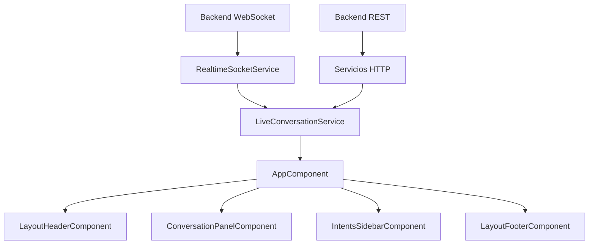
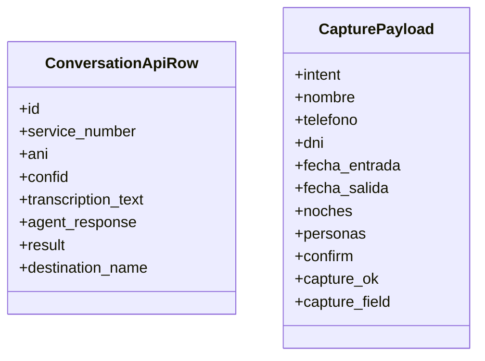
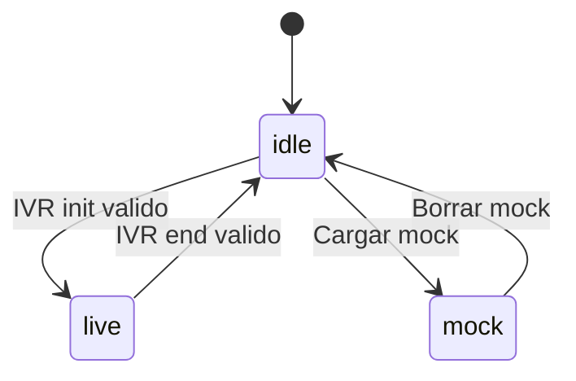
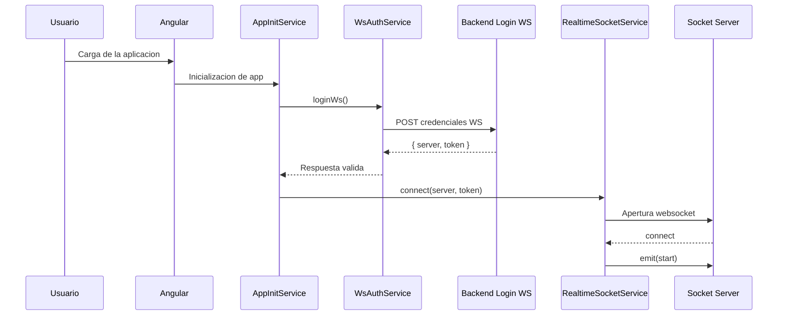
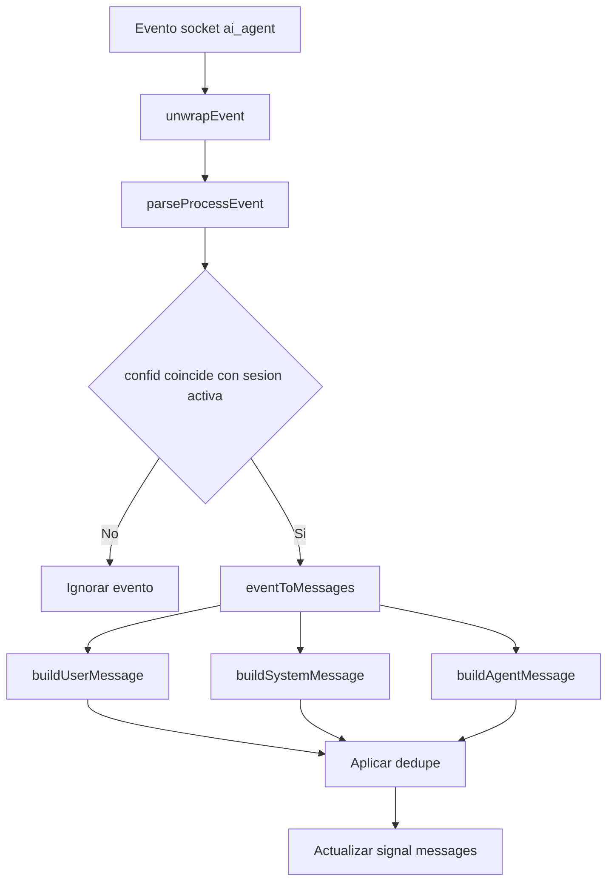
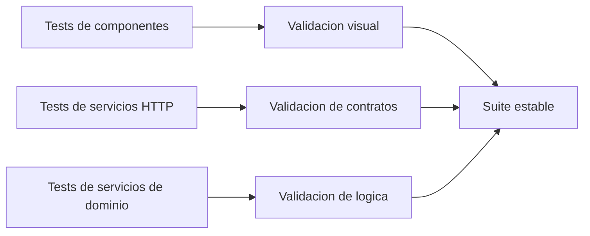

# Memoria Tecnica de Funcionamiento de la Aplicacion

## Indice

1. Introduccion
2. Objetivos funcionales y no funcionales
3. Vision general de la solucion
4. Arquitectura de la aplicacion
5. Modelo de datos y contratos de intercambio
6. Funcionamiento interno del frontend
7. Gestion de modos de conversacion: idle, live y mock
8. Flujo de inicializacion y conexion en tiempo real
9. Procesamiento de eventos y transformacion a interfaz
10. Configuracion, entornos y control del modo mock
11. Estrategia de pruebas y validacion
12. Posibles lineas de evolucion
13. Conclusiones

## 1. Introduccion

La aplicacion desarrollada es un dashboard frontend en Angular orientado a la monitorizacion de conversaciones entre un cliente, un sistema IVR y un agente conversacional basado en inteligencia artificial. Su finalidad principal es ofrecer una vista unificada del dialogo, de las entidades capturadas durante la interaccion y del payload tecnico que sustenta cada evento relevante del flujo.

Desde una perspectiva academica y profesional, el valor de la solucion reside en su capacidad para actuar como capa de observabilidad funcional. No se limita a representar mensajes en pantalla, sino que organiza el estado de una conversacion a partir de eventos recibidos en tiempo real, permite auditar decisiones del agente y facilita la validacion del comportamiento extremo a extremo del sistema conversacional.

La aplicacion se ha construido con una doble orientacion:

- Permitir demostraciones funcionales mediante datos mock realistas.
- Estar preparada para integrarse con backend real mediante API REST y websocket.

## 2. Objetivos funcionales y no funcionales

### 2.1 Objetivos funcionales

Los objetivos funcionales de la aplicacion son los siguientes:

- Representar la conversacion en formato chat diferenciando mensajes de cliente, sistema y agente IA.
- Mostrar en una barra lateral las entidades e intenciones capturadas durante la llamada.
- Permitir inspeccionar el payload raw asociado a un mensaje concreto.
- Soportar un modo mock cargable manualmente para demostracion y validacion visual.
- Escuchar eventos de backend en tiempo real y convertirlos en mensajes de interfaz.
- Filtrar llamadas por numeros de cliente y servicio autorizados para evitar ruido en pruebas.

### 2.2 Objetivos no funcionales

A nivel no funcional, el sistema busca:

- Separacion clara entre presentacion, modelos y servicios.
- Facilidad de mantenimiento mediante componentes standalone y servicios cohesionados.
- Trazabilidad documental gracias al uso de TSDoc y a la exportacion automatica con TypeDoc.
- Testabilidad de la logica critica, especialmente la transformacion de eventos a mensajes de UI.

## 3. Vision general de la solucion

La aplicacion puede entenderse como una capa de adaptacion entre eventos tecnicos y una representacion visual orientada a negocio y validacion funcional. El sistema recibe informacion desde dos grandes fuentes:

- Endpoints HTTP para consulta estructurada de historicos y entidades capturadas.
- Eventos websocket para seguir el estado vivo de una conversacion activa.

Esa informacion se traduce en tres zonas de interfaz principales:

- Cabecera con acciones de control.
- Panel central de conversacion.
- Sidebar de intenciones capturadas.

## 4. Arquitectura de la aplicacion

La arquitectura sigue una organizacion por capas ligera, adecuada para una aplicacion Angular de monitorizacion en tiempo real.

### 4.1 Capa de presentacion

La capa de presentacion esta formada por componentes standalone:

- `AppComponent`: componente raiz y orquestador principal.
- `LayoutHeaderComponent`: controles de tema, mock y filtros runtime.
- `ConversationPanelComponent`: render de la conversacion y drawer de payload raw.
- `IntentsSidebarComponent`: visualizacion de intenciones y entidades capturadas.
- `LayoutFooterComponent`: informacion contextual del proyecto.

### 4.2 Capa de servicios

La capa de servicios encapsula la logica de acceso a datos y coordinacion de estado:

- `ConversationApiService`: consulta historicos de conversacion por REST.
- `CapturedEntitiesApiService`: recupera entidades capturadas.
- `WsAuthService`: solicita credenciales para abrir websocket.
- `AppInitService`: realiza la inicializacion temprana de la conexion websocket.
- `RealtimeSocketService`: abstrae la conexion `socket.io-client`.
- `LiveConversationService`: pieza central que interpreta eventos y mantiene el estado reactivo de la conversacion.

### 4.3 Capa de modelos

Los modelos de dominio se definen en:

- `conversation.models.ts`
- `api.models.ts`

En ellos se tipan mensajes, intenciones, payloads y contratos de backend. Esta tipificacion reduce ambiguedad y mejora la robustez del sistema.

## 5. Modelo de datos y contratos de intercambio

La aplicacion diferencia dos niveles de datos:

- Datos visuales orientados a interfaz.
- Datos tecnicos orientados a integracion con backend.

### 5.1 Modelo visual principal

El tipo `ConversationMessage` define la unidad basica mostrada en el panel de conversacion:

- `id`
- `author`
- `role`
- `time`
- `text`

Este modelo no replica necesariamente el payload crudo del backend. Es un view model simplificado, pensado para la presentacion.

### 5.2 Modelo de intenciones capturadas

El tipo `CapturedIntent` representa una entidad o intencion mostrada en la sidebar:

- `title`
- `detail`
- `status`

El `status` usa una taxonomia visual compacta:

- `confirmed`
- `detected`
- `pending`

### 5.3 Contratos REST

Los contratos REST conservan nombres de backend en `snake_case` para minimizar transformaciones innecesarias en la capa HTTP. Esta decision es importante porque evita introducir una fase prematura de mapeo y facilita depuracion cuando el equipo compara trazas de frontend y backend.

## 6. Funcionamiento interno del frontend

### 6.1 Papel de AppComponent

`AppComponent` actua como capa de coordinacion. No implementa la logica tecnica profunda del sistema en tiempo real, pero si realiza las siguientes funciones:

- Consume los signals expuestos por `LiveConversationService`.
- Propaga datos a los componentes hijos.
- Coordina la seleccion del mensaje cuyo payload raw debe mostrarse.
- Aplica la configuracion de entorno, especialmente la flag `showMock`.

Puede entenderse como un adaptador entre el estado reactivo del dominio y el arbol de componentes.

### 6.2 Cabecera operativa

`LayoutHeaderComponent` concentra acciones de operador:

- Cambio de tema.
- Carga y limpieza del modo mock.
- Apertura del panel de filtros runtime.
- Alta y baja de numeros temporales de cliente y servicio.

La cabecera no contiene logica de negocio del flujo conversacional. Su responsabilidad es estrictamente interactiva y de emision de eventos hacia el componente raiz.

### 6.3 Panel de conversacion

`ConversationPanelComponent` transforma el estado actual en una vista altamente interpretable:

- Cuando no hay mensajes muestra un estado vacio.
- Cuando hay mensajes renderiza el hilo conversacional.
- Los mensajes de sistema tienen un tratamiento visual diferenciado.
- El payload raw se muestra en un drawer lateral cuando el usuario selecciona un mensaje.

### 6.4 Sidebar de intenciones

`IntentsSidebarComponent` expone una lectura semantica de la conversacion. Mientras el panel central muestra el dialogo, la sidebar resume la informacion estructurada que el agente ha inferido o confirmado.

## 7. Gestion de modos de conversacion: idle, live y mock

Una de las decisiones mas relevantes del sistema es modelar el estado de la conversacion como una maquina de estados simplificada.

Los modos disponibles son:

- `idle`: la aplicacion esta en espera de una llamada valida.
- `live`: existe una llamada activa en tiempo real.
- `mock`: se ha cargado manualmente una conversacion simulada.

La principal ventaja de este enfoque es que simplifica tanto la interfaz como el testing. Cada modo tiene reglas claras de comportamiento, lo que reduce estados intermedios ambiguos.

## 8. Flujo de inicializacion y conexion en tiempo real

El arranque de la aplicacion no se limita al bootstrap de Angular. Existe una fase de inicializacion funcional que prepara la conexion en tiempo real.

### 8.1 Secuencia de arranque

1. Angular arranca con `app.config.ts`.
2. Se registra `provideWsAppInit()`.
3. `AppInitService` solicita credenciales al backend mediante `WsAuthService`.
4. Si la respuesta contiene `server` y `token`, `RealtimeSocketService` abre la conexion websocket.
5. Una vez conectado el socket, la aplicacion queda preparada para escuchar canales `ivr` y `ai_agent`.

### 8.2 Ventajas del arranque temprano

Esta estrategia presenta varias ventajas:

- La aplicacion queda lista para escuchar eventos desde el inicio.
- Se evita que el usuario tenga que lanzar manualmente la conexion.
- Se reduce el riesgo de perder eventos tempranos en una llamada valida.

## 9. Procesamiento de eventos y transformacion a interfaz

`LiveConversationService` es el nucleo funcional de la aplicacion. Su papel es recibir eventos tecnicos y traducirlos a mensajes renderizables y estados de interfaz.

### 9.1 Eventos IVR

El canal `ivr` controla principalmente el ciclo de vida de la llamada:

- `init`: inicia la sesion viva si la llamada es valida.
- `end`: cierra la sesion si coincide con la conversacion activa.

Antes de aceptar una llamada, el servicio aplica filtros:

- La direccion debe ser `incoming`.
- El numero de cliente debe estar permitido.
- El numero de servicio debe estar permitido.

### 9.2 Eventos del agente

El canal `ai_agent` contiene informacion rica sobre la interaccion. Estos eventos se parsean y se convierten en un modelo intermedio. A partir de ese modelo, el servicio decide si debe generar:

- Un mensaje del usuario.
- Un mensaje del sistema.
- Un mensaje del agente.

### 9.3 Dedupe de mensajes

Para evitar duplicados visuales, el servicio mantiene estructuras internas de deduplicacion. Esto es importante porque en sistemas event-driven no es raro recibir eventos repetidos o solapados.

### 9.4 Transformacion funcional

La logica de transformacion sigue este esquema:

### 9.5 Casos especiales relevantes

La aplicacion contempla casos que son especialmente importantes en telefonia conversacional:

- `NOINPUT_RETRY` y `NOMATCH_RETRY`: se representan como una intervencion vacia del usuario y una ayuda del agente.
- `AGENT_OK_ACTION`: puede generar simultaneamente un mensaje de sistema y una salida del agente.
- `HANGUP`: se ignora en la construccion de mensajes visuales para no contaminar el hilo conversacional.

## 10. Configuracion, entornos y control del modo mock

La configuracion de la aplicacion se centraliza en los archivos de entorno.

Variables destacadas:

- `production`
- `apiBaseUrl`
- `login`
- `showMock`

### 10.1 Papel de showMock

La flag `showMock` no es meramente cosmetica. Su comportamiento se ha diseñado en dos niveles:

- Nivel de vista: oculta o muestra los botones de mock en la cabecera.
- Nivel de logica: bloquea en `AppComponent` la carga o limpieza del mock cuando la flag esta desactivada.

Esta doble proteccion es importante porque evita que la funcionalidad quede accesible solo porque alguien dispare un evento desde fuera del template.

### 10.2 Filtros runtime

La cabecera permite añadir numeros adicionales de cliente y servicio en memoria. Estos filtros:

- Se normalizan antes de almacenarse.
- Se combinan con los permitidos por defecto.
- Solo viven durante la sesion actual.

Esto convierte la aplicacion en una herramienta muy util para pruebas controladas en entornos compartidos.

## 11. Estrategia de pruebas y validacion

La validacion de la aplicacion se ha estructurado alrededor de pruebas unitarias de componentes y servicios.

### 11.1 Cobertura funcional implementada

Se han incorporado pruebas para:

- `AppComponent`
- `ConversationPanelComponent`
- `IntentsSidebarComponent`
- `LayoutHeaderComponent`
- `LayoutFooterComponent`
- `ConversationApiService`
- `CapturedEntitiesApiService`
- `WsAuthService`
- `AppInitService`
- `RealtimeSocketService`
- `LiveConversationService`

### 11.2 Aspectos verificados

La suite valida, entre otros, los siguientes comportamientos:

- Render de estados vacios y badges visuales.
- Emision de eventos de interfaz desde componentes.
- Construccion de query params REST.
- Generacion del payload de autenticacion websocket.
- Inicializacion correcta del websocket en el arranque.
- Transformacion de eventos `ivr` y `ai_agent` en mensajes de interfaz.
- Deteccion de llamadas no permitidas.
- Dedupe de mensajes repetidos.
- Transicion correcta entre estados `idle`, `live` y `mock`.

### 11.3 Resultado de ejecucion

La suite actual ejecuta correctamente `41` pruebas unitarias con resultado satisfactorio.

## 12. Posibles lineas de evolucion

Desde un punto de vista de continuidad del trabajo, la aplicacion ofrece varias lineas naturales de evolucion:

- Integrar en la UI las respuestas REST reales para historicos y entidades.
- Incorporar manejo explicito de estados de carga y error.
- Añadir persistencia de filtros runtime por usuario.
- Incorporar exportacion de sesiones o trazas.
- Añadir pruebas E2E para cubrir la experiencia completa de operador.
- Introducir adaptadores formales entre payload raw de backend y view models del frontend.

## 13. Conclusiones

La aplicacion desarrollada constituye una base solida para observabilidad funcional de sistemas conversacionales con IVR y agentes IA. Su principal fortaleza es la separacion entre la complejidad del evento tecnico y la simplicidad de la representacion visual final. Este desacoplamiento permite que operadores, desarrolladores y responsables funcionales trabajen sobre una misma herramienta con distintos niveles de lectura.

Desde el punto de vista de ingenieria del software, destacan especialmente tres aportaciones:

- El uso de un servicio de dominio central (`LiveConversationService`) para encapsular la logica de transformacion.
- La coexistencia controlada entre modo mock y modo live.
- La incorporacion de una estrategia de pruebas automatizadas que valida tanto la presentacion como la logica de negocio.

En conjunto, la solucion no solo resuelve un problema de visualizacion, sino que sienta las bases de una plataforma mantenible, documentada y preparada para evolucionar hacia escenarios reales de explotacion y analitica conversacional.
